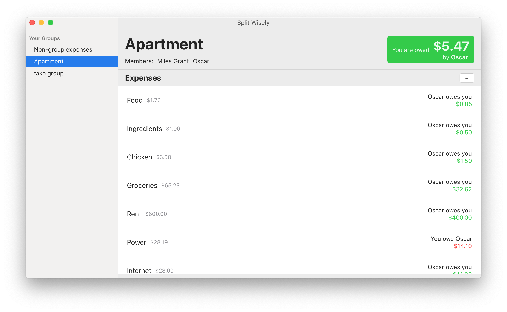
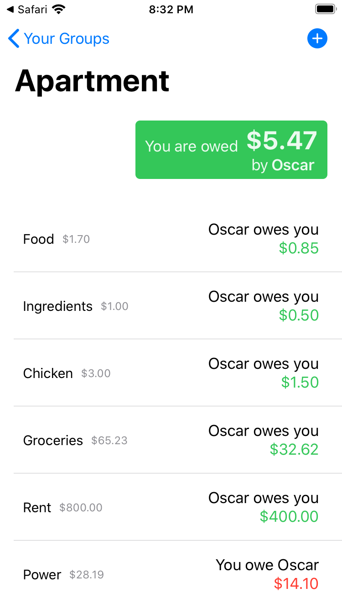

# Splitwise MacOS App

Wanted to make a SwiftUI app, and saw that there was no decent native Mac app for [https://secure.splitwise.com/#/dashboard](Splitwise).

I threw this together in about a day. It’s not perfect (I think it will crash if you are splitting with more than one person), and there are a few things tailored to how I use the app. But I'm still pretty proud of it! I'm still learning SwiftUI, but I think I'm slowly starting to get it and how it was meant to be used.

Either way the app shows you all your expenses across all your groups, and allows you to add expenses or settle up.

### To Install
`brew tap mlsgrnt/splitwise-for-mac`

and then

`brew cask install splitwise-for-mac`

Or grab the zip file from the releases page. 

#### Since I refuse to pay Apple $99 a year, the app will only open by right clicking it and clicking open.

# iOS App
Since this is a simple app and all views are written with SwiftUI, I was able to port the app to iOS in just a few hours! Models, as well as a few subviews are entirely shared!

Really good experience although think the small functionality really helped.

Would love to release it, but I sadly don’t have $99…